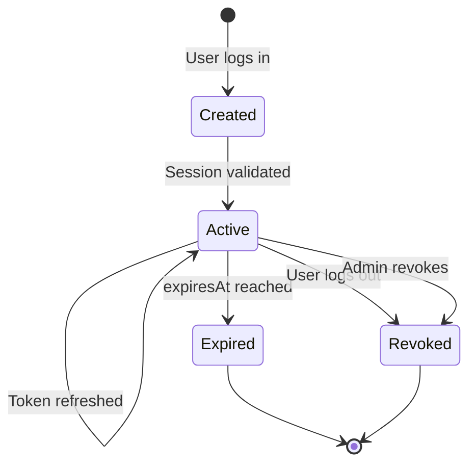

## Overview

Renta Pelis Backend implements comprehensive session management to track user login sessions across different devices and locations. Sessions store refresh tokens and metadata about the device and connection used for authentication.

## Session Model

Sessions are stored in the database with the following structure:

```prisma schema.prisma
model Session {
  id String @id @default(uuid())
  
  userId String
  user   User   @relation(fields: [userId], references: [user_id], onDelete: Cascade)
  
  refreshToken String   // Refresh token for this session
  
  userAgent String?     // Browser/client user agent
  ipAddress String?     // IP address of the connection
  location  String?     // Geographic location (if available)
  
  isActive Boolean @default(true)
  
  expiresAt  DateTime?  // Session expiration timestamp
  createdAt  DateTime  @default(now())
  lastUsedAt DateTime  @updatedAt
  
  @@index([userId])
  @@index([userAgent])
  @@index([ipAddress])
}
```

## Session Data Transfer Objects

### CreateSessionDto

Used to create a new session:

```typescript create-session.dto.ts
export class CreateSessionDto {
  @IsString()
  @IsNotEmpty()
  @IsUUID()
  userId!: string;

  @IsString()
  @IsNotEmpty()
  refreshToken!: string;

  @IsString()
  @IsOptional()
  userAgent?: string;

  @IsString()
  @IsOptional()
  ipAddress?: string;

  @IsString()
  @IsOptional()
  location?: string;

  @IsDateString()
  @IsOptional()
  expiresAt?: Date;
}
```

### UpdateSessionDto

Used to update an existing session:

```typescript update-session.dto.ts
export class UpdateSessionDto extends PartialType(CreateSessionDto) {
  @IsString()
  @IsNotEmpty()
  @IsUUID()
  id!: string;

  @IsBoolean()
  @IsOptional()
  isActive?: boolean;
}
```

## Creating Sessions

Sessions are typically created during the login process:

```typescript sessions.service.ts
async create(createSessionDto: CreateSessionDto) {
  try {
    const { userId, ...sessionData } = createSessionDto;

    return await this.prisma.session.create({
      data: {
        ...sessionData,
        // Connect the session to existing user
        user: {
          connect: { user_id: userId },
        },
      },
      select: {
        id: true,
        userId: true,
        userAgent: true,
        ipAddress: true,
        location: true,
        isActive: true,
        expiresAt: true,
        createdAt: true,
        lastUsedAt: true,
      },
    });
  } catch (error) {
    if (error instanceof Prisma.PrismaClientKnownRequestError) {
      if (error.code === 'P2025' || error.code === 'P2003') {
        throw new NotFoundException(
          `El usuario con ID ${createSessionDto.userId} no existe.`,
        );
      }
    }
    throw new InternalServerErrorException(
      'Error al crear la sesión en la base de datos',
    );
  }
}
```

### Example: Creating a Session

<CodeGroup>

```bash cURL
curl -X POST https://api.rentapelis.com/sessions \
  -H "Content-Type: application/json" \
  -d '{
    "userId": "550e8400-e29b-41d4-a716-446655440000",
    "refreshToken": "eyJhbGciOiJIUzI1NiIsInR5cCI6IkpXVCJ9...",
    "userAgent": "Mozilla/5.0 (Windows NT 10.0; Win64; x64) AppleWebKit/537.36",
    "ipAddress": "192.168.1.100",
    "location": "Bogotá, Colombia",
    "expiresAt": "2026-04-06T12:00:00Z"
  }'
```

```javascript JavaScript
const response = await fetch('https://api.rentapelis.com/sessions', {
  method: 'POST',
  headers: {
    'Content-Type': 'application/json',
  },
  body: JSON.stringify({
    userId: '550e8400-e29b-41d4-a716-446655440000',
    refreshToken: 'eyJhbGciOiJIUzI1NiIsInR5cCI6IkpXVCJ9...',
    userAgent: navigator.userAgent,
    ipAddress: '192.168.1.100',
    location: 'Bogotá, Colombia',
    expiresAt: new Date(Date.now() + 30 * 24 * 60 * 60 * 1000).toISOString()
  })
});

const session = await response.json();
```

</CodeGroup>

## Device Tracking

Sessions capture device and connection information for security and user experience:

### User Agent

The `userAgent` field stores information about the client application:

```typescript
// Example user agents
const userAgents = [
  'Mozilla/5.0 (Windows NT 10.0; Win64; x64) AppleWebKit/537.36',
  'Mozilla/5.0 (iPhone; CPU iPhone OS 14_6 like Mac OS X)',
  'Mozilla/5.0 (Macintosh; Intel Mac OS X 10_15_7)',
];
```

This can be used to:
- Identify the device type (desktop, mobile, tablet)
- Display friendly device names to users
- Detect suspicious login patterns

### IP Address

The `ipAddress` field stores the client's IP address:

```typescript
// Extract IP from request
const ipAddress = request.ip || 
                  request.headers['x-forwarded-for'] || 
                  request.connection.remoteAddress;
```

Use cases:
- Detect logins from unusual locations
- Implement rate limiting
- Geographic restriction enforcement

### Location

The `location` field stores geographic information:

```typescript
// Example location formats
const locations = [
  'Bogotá, Colombia',
  'Madrid, Spain',
  'New York, USA',
];
```

<Note>
  Location data typically comes from IP geolocation services. Consider using services like MaxMind GeoIP2 or IPinfo for accurate location detection.
</Note>

## Retrieving Sessions

Users can view all their active and past sessions:

```typescript sessions.service.ts
async findAllUserSessions(userId: string) {
  return await this.prisma.session.findMany({
    where: {
      userId: userId,
      // isActive: true, // Uncomment to only show active sessions
    },
    select: {
      id: true,
      userId: true,
      userAgent: true,
      ipAddress: true,
      location: true,
      isActive: true,
      expiresAt: true,
      createdAt: true,
      lastUsedAt: true,
    },
    orderBy: { createdAt: 'desc' },
  });
}
```

### Example Response

```json
[
  {
    "id": "123e4567-e89b-12d3-a456-426614174000",
    "userId": "550e8400-e29b-41d4-a716-446655440000",
    "userAgent": "Mozilla/5.0 (Windows NT 10.0; Win64; x64)",
    "ipAddress": "192.168.1.100",
    "location": "Bogotá, Colombia",
    "isActive": true,
    "expiresAt": "2026-04-06T12:00:00Z",
    "createdAt": "2026-03-06T10:00:00Z",
    "lastUsedAt": "2026-03-06T11:30:00Z"
  },
  {
    "id": "234e5678-e89b-12d3-a456-426614174001",
    "userId": "550e8400-e29b-41d4-a716-446655440000",
    "userAgent": "Mozilla/5.0 (iPhone; CPU iPhone OS 14_6)",
    "ipAddress": "192.168.1.101",
    "location": "Medellín, Colombia",
    "isActive": false,
    "expiresAt": "2026-03-05T12:00:00Z",
    "createdAt": "2026-02-04T08:00:00Z",
    "lastUsedAt": "2026-03-04T22:00:00Z"
  }
]
```

## Session Lifecycle

Sessions follow a specific lifecycle from creation to expiration:



### Session States

<AccordionGroup>
  <Accordion title="Created">
    A new session is created when a user successfully logs in. The session includes a refresh token and device metadata.
  </Accordion>
  
  <Accordion title="Active">
    The session is active and can be used to refresh access tokens. The `isActive` field is `true`.
  </Accordion>
  
  <Accordion title="Expired">
    The session has passed its `expiresAt` timestamp and can no longer be used. Expired sessions should be cleaned up periodically.
  </Accordion>
  
  <Accordion title="Revoked">
    The session was manually terminated by the user or an administrator. The `isActive` field is set to `false`.
  </Accordion>
</AccordionGroup>

## Updating Sessions

Sessions can be updated to change their status or refresh timestamp:

```typescript sessions.service.ts
async update(userId: string, payload: UpdateSessionDto) {
  try {
    return await this.prisma.session.update({
      where: {
        userId: userId,
        id: payload.id,
      },
      data: payload,
      select: {
        id: true,
        userId: true,
        userAgent: true,
        ipAddress: true,
        location: true,
        isActive: true,
        expiresAt: true,
        createdAt: true,
        lastUsedAt: true,
      },
    });
  } catch (error) {
    if (
      error instanceof Prisma.PrismaClientKnownRequestError &&
      error.code === 'P2025'
    ) {
      throw new NotFoundException(`Usuario con id ${userId} no existe`);
    }
    throw new InternalServerErrorException('Error al actualizar');
  }
}
```

### Example: Deactivating a Session

```bash
curl -X PATCH https://api.rentapelis.com/sessions/550e8400-e29b-41d4-a716-446655440000 \
  -H "Content-Type: application/json" \
  -H "Authorization: Bearer <token>" \
  -d '{
    "id": "123e4567-e89b-12d3-a456-426614174000",
    "isActive": false
  }'
```

## Deleting Sessions

Sessions can be deleted individually or in bulk:

### Delete Single Session

```typescript sessions.service.ts
async remove(userId: string, payload: DeleteSessionDto) {
  try {
    return await this.prisma.session.delete({
      where: { userId: userId, id: payload.id },
    });
  } catch (error) {
    if (
      error instanceof Prisma.PrismaClientKnownRequestError &&
      error.code === 'P2025'
    ) {
      throw new NotFoundException(
        `Usuario con id ${userId} no existe para eliminar`,
      );
    }
    throw new InternalServerErrorException();
  }
}
```

### Delete All User Sessions

Useful for "log out from all devices" functionality:

```typescript sessions.service.ts
async deleteAllUserSessions(userId: string) {
  try {
    return await this.prisma.session.deleteMany({
      where: { userId: userId },
    });
  } catch (error) {
    if (
      error instanceof Prisma.PrismaClientKnownRequestError &&
      error.code === 'P2025'
    ) {
      throw new NotFoundException(
        `Usuario con id ${userId} no existe para eliminar sesiones`,
      );
    }
    throw new InternalServerErrorException();
  }
}
```

## API Endpoints

<Card title="Sessions API" icon="code" href="/api/sessions/create-session">
  View complete session management API documentation
</Card>

### Available Endpoints

<ResponseField name="POST /sessions" type="endpoint">
  Create a new session for a user
</ResponseField>

<ResponseField name="GET /sessions/:userId" type="endpoint">
  Get all sessions for a specific user
</ResponseField>

<ResponseField name="PATCH /sessions/:userId" type="endpoint">
  Update a session (e.g., mark as inactive)
</ResponseField>

<ResponseField name="DELETE /sessions/:userId" type="endpoint">
  Delete a specific session
</ResponseField>

## Security Considerations

<AccordionGroup>
  <Accordion title="Session Expiration">
    Always set appropriate expiration times for sessions:
    
    ```typescript
    const expiresAt = new Date();
    expiresAt.setDate(expiresAt.getDate() + 30); // 30 days
    ```
    
    Recommended expiration times:
    - Web applications: 7-30 days
    - Mobile applications: 30-90 days
    - High-security applications: 1-7 days
  </Accordion>
  
  <Accordion title="Concurrent Session Limits">
    Consider limiting the number of active sessions per user:
    
    ```typescript
    async create(createSessionDto: CreateSessionDto) {
      // Count active sessions
      const activeCount = await this.prisma.session.count({
        where: { 
          userId: createSessionDto.userId,
          isActive: true 
        },
      });
      
      // Enforce limit (e.g., max 5 devices)
      if (activeCount >= 5) {
        // Delete oldest session or throw error
        throw new BadRequestException('Maximum session limit reached');
      }
      
      // Create new session...
    }
    ```
  </Accordion>
  
  <Accordion title="Suspicious Activity Detection">
    Monitor sessions for suspicious patterns:
    - Logins from multiple countries in short time periods
    - Unusual user agent changes
    - High frequency of session creation
    
    Implement alerts or automatic session revocation when detected.
  </Accordion>
  
  <Accordion title="Session Cleanup">
    Implement a scheduled job to remove expired sessions:
    
    ```typescript
    @Cron('0 0 * * *') // Run daily at midnight
    async cleanupExpiredSessions() {
      await this.prisma.session.deleteMany({
        where: {
          OR: [
            { expiresAt: { lt: new Date() } },
            { 
              isActive: false,
              lastUsedAt: { lt: new Date(Date.now() - 90 * 24 * 60 * 60 * 1000) }
            }
          ]
        }
      });
    }
    ```
  </Accordion>
  
  <Accordion title="Refresh Token Rotation">
    Implement refresh token rotation for enhanced security:
    
    1. When a refresh token is used, generate a new one
    2. Invalidate the old refresh token
    3. Update the session with the new refresh token
    4. If an old refresh token is reused, revoke all sessions (possible token theft)
  </Accordion>
</AccordionGroup>

## User Experience Patterns

### Session Management UI

Provide users with visibility and control over their sessions:

```typescript
// Frontend example
interface SessionDisplay {
  id: string;
  deviceName: string;    // Parsed from userAgent
  location: string;
  lastActive: string;    // Formatted lastUsedAt
  current: boolean;      // Is this the current session?
}

function formatSession(session: Session): SessionDisplay {
  return {
    id: session.id,
    deviceName: parseUserAgent(session.userAgent),
    location: session.location || 'Unknown',
    lastActive: formatRelativeTime(session.lastUsedAt),
    current: session.id === currentSessionId,
  };
}
```

### "Remember Me" Functionality

Implement longer session durations for "Remember Me":

```typescript
function getSessionExpiration(rememberMe: boolean): Date {
  const expiresAt = new Date();
  
  if (rememberMe) {
    expiresAt.setDate(expiresAt.getDate() + 30); // 30 days
  } else {
    expiresAt.setDate(expiresAt.getDate() + 1);  // 1 day
  }
  
  return expiresAt;
}
```

## Next Steps

<CardGroup cols={2}>
  <Card title="Two-Factor Auth" icon="mobile" href="/auth/two-factor">
    Add an extra layer of security with 2FA
  </Card>
  <Card title="JWT Tokens" icon="key" href="/auth/jwt-tokens">
    Learn about access token management
  </Card>
</CardGroup>