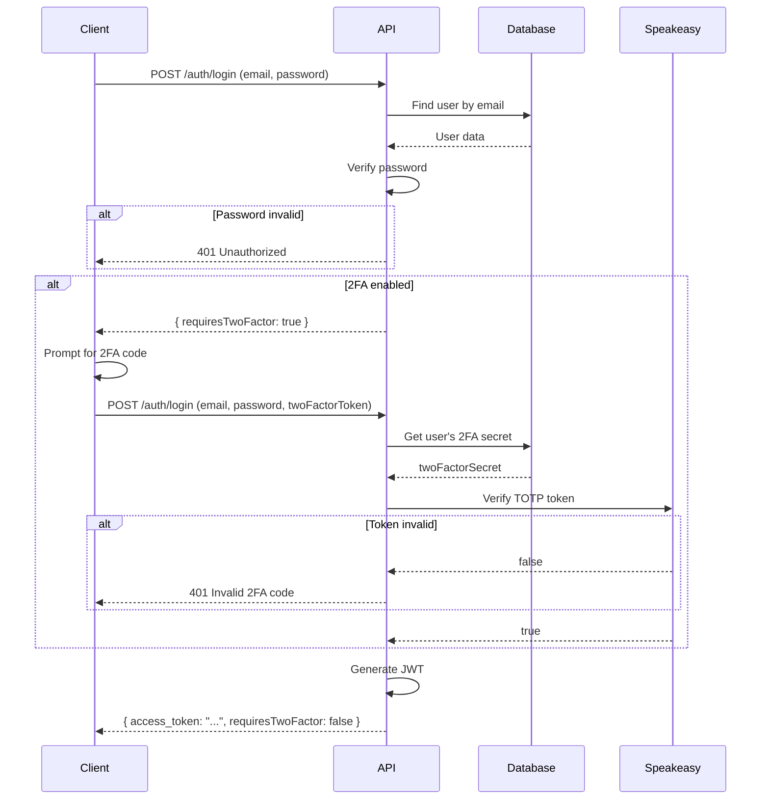

## Overview

Renta Pelis Backend supports Time-based One-Time Password (TOTP) two-factor authentication using the `speakeasy` library. This provides an additional layer of security beyond username and password authentication.

## Database Schema

Two-factor authentication is tracked in the User model:

```prisma schema.prisma
model User {
  user_id      String     @id @default(uuid())
  name         String
  lastName     String     @map("last_name")
  email        String     @unique
  passwordHash String     @map("password_hash")
  
  // ... other fields
  
  twoFactorEnable Boolean   @default(false)
  twoFactorSecret String?
  
  // ... relations
}
```

<ParamField path="twoFactorEnable" type="boolean" default="false">
  Indicates whether 2FA is enabled for the user
</ParamField>

<ParamField path="twoFactorSecret" type="string" optional>
  Stores the base32-encoded secret for TOTP generation. Only set when 2FA is enabled.
</ParamField>

## Dependencies

The system uses the following packages:

```json package.json
{
  "dependencies": {
    "speakeasy": "^2.0.0",
    "qrcode": "^1.5.4"
  },
  "devDependencies": {
    "@types/speakeasy": "^2.0.10",
    "@types/qrcode": "^1.5.6"
  }
}
```

- **speakeasy**: Generates and verifies TOTP codes
- **qrcode**: Creates QR codes for authenticator app setup

## Enabling Two-Factor Authentication

The 2FA setup process involves several steps:

<Steps>
  <Step title="Generate Secret">
    Generate a unique secret for the user:
    
    ```typescript
    import * as speakeasy from 'speakeasy';
    
    const secret = speakeasy.generateSecret({
      name: `Renta Pelis (${user.email})`,
      issuer: 'Renta Pelis',
      length: 32,
    });
    
    // secret.base32 contains the secret to store
    // secret.otpauth_url contains the URL for QR code
    ```
  </Step>
  
  <Step title="Generate QR Code">
    Create a QR code for the user to scan with their authenticator app:
    
    ```typescript
    import * as QRCode from 'qrcode';
    
    const qrCodeDataURL = await QRCode.toDataURL(secret.otpauth_url);
    
    // Return this data URL to the client
    // Frontend can display it as an image
    ```
  </Step>
  
  <Step title="Display Setup Information">
    Show the user:
    - QR code to scan
    - Manual entry key (secret.base32) as fallback
    - Instructions for their authenticator app
  </Step>
  
  <Step title="Verify Initial Code">
    Have the user enter a code from their authenticator app to verify setup:
    
    ```typescript
    const verified = speakeasy.totp.verify({
      secret: secret.base32,
      encoding: 'base32',
      token: userProvidedCode,
      window: 2, // Allow 2 time steps before/after
    });
    
    if (!verified) {
      throw new UnauthorizedException('Código de verificación inválido');
    }
    ```
  </Step>
  
  <Step title="Save Secret">
    Once verified, save the secret and enable 2FA:
    
    ```typescript
    await this.prisma.user.update({
      where: { user_id: userId },
      data: {
        twoFactorSecret: secret.base32,
        twoFactorEnable: true,
      },
    });
    ```
  </Step>
</Steps>

## Complete Setup Implementation

Here's a complete implementation example:

```typescript two-factor.service.ts
import { Injectable, UnauthorizedException, BadRequestException } from '@nestjs/common';
import { PrismaService } from '../prisma/prisma.service';
import * as speakeasy from 'speakeasy';
import * as QRCode from 'qrcode';

@Injectable()
export class TwoFactorService {
  constructor(private readonly prisma: PrismaService) {}

  /**
   * Generate 2FA secret and QR code for user
   */
  async generateSecret(userId: string) {
    const user = await this.prisma.user.findUnique({
      where: { user_id: userId },
      select: { email: true, twoFactorEnable: true },
    });

    if (!user) {
      throw new BadRequestException('Usuario no encontrado');
    }

    if (user.twoFactorEnable) {
      throw new BadRequestException('2FA ya está habilitado');
    }

    // Generate secret
    const secret = speakeasy.generateSecret({
      name: `Renta Pelis (${user.email})`,
      issuer: 'Renta Pelis',
      length: 32,
    });

    // Generate QR code
    const qrCodeDataURL = await QRCode.toDataURL(secret.otpauth_url);

    // Temporarily store secret (not yet enabled)
    await this.prisma.user.update({
      where: { user_id: userId },
      data: { twoFactorSecret: secret.base32 },
    });

    return {
      secret: secret.base32,
      qrCode: qrCodeDataURL,
    };
  }

  /**
   * Enable 2FA after verifying the initial code
   */
  async enableTwoFactor(userId: string, token: string) {
    const user = await this.prisma.user.findUnique({
      where: { user_id: userId },
      select: { twoFactorSecret: true, twoFactorEnable: true },
    });

    if (!user || !user.twoFactorSecret) {
      throw new BadRequestException('Primero debes generar un secreto 2FA');
    }

    if (user.twoFactorEnable) {
      throw new BadRequestException('2FA ya está habilitado');
    }

    // Verify the token
    const verified = speakeasy.totp.verify({
      secret: user.twoFactorSecret,
      encoding: 'base32',
      token,
      window: 2,
    });

    if (!verified) {
      throw new UnauthorizedException('Código de verificación inválido');
    }

    // Enable 2FA
    await this.prisma.user.update({
      where: { user_id: userId },
      data: { twoFactorEnable: true },
    });

    return { success: true, message: '2FA habilitado correctamente' };
  }

  /**
   * Verify a 2FA token
   */
  async verifyToken(userId: string, token: string): Promise<boolean> {
    const user = await this.prisma.user.findUnique({
      where: { user_id: userId },
      select: { twoFactorSecret: true, twoFactorEnable: true },
    });

    if (!user || !user.twoFactorEnable || !user.twoFactorSecret) {
      return false;
    }

    return speakeasy.totp.verify({
      secret: user.twoFactorSecret,
      encoding: 'base32',
      token,
      window: 2,
    });
  }

  /**
   * Disable 2FA
   */
  async disableTwoFactor(userId: string, token: string) {
    const user = await this.prisma.user.findUnique({
      where: { user_id: userId },
      select: { twoFactorSecret: true, twoFactorEnable: true },
    });

    if (!user || !user.twoFactorEnable) {
      throw new BadRequestException('2FA no está habilitado');
    }

    // Verify token before disabling
    const verified = speakeasy.totp.verify({
      secret: user.twoFactorSecret,
      encoding: 'base32',
      token,
      window: 2,
    });

    if (!verified) {
      throw new UnauthorizedException('Código de verificación inválido');
    }

    // Disable 2FA and remove secret
    await this.prisma.user.update({
      where: { user_id: userId },
      data: {
        twoFactorEnable: false,
        twoFactorSecret: null,
      },
    });

    return { success: true, message: '2FA deshabilitado correctamente' };
  }
}
```

## Integrating 2FA with Login

Modify the login flow to require 2FA verification when enabled:

```typescript auth.service.ts
async login({ email, password, twoFactorToken }: LoginDto) {
  const user = await this.usersService.findByEmail(email);
  
  if (!user) {
    throw new UnauthorizedException('Usuario no encontrado');
  }

  // Verify password
  const isPasswordValid = await this.hashingService.compare(
    password.trim(),
    user.passwordHash,
  );

  if (!isPasswordValid) {
    throw new UnauthorizedException('Contraseña incorrecta');
  }

  // Check if 2FA is enabled
  if (user.twoFactorEnable) {
    if (!twoFactorToken) {
      // Return indication that 2FA is required
      return {
        requiresTwoFactor: true,
        message: 'Por favor proporciona tu código 2FA',
      };
    }

    // Verify 2FA token
    const verified = await this.twoFactorService.verifyToken(
      user.user_id,
      twoFactorToken,
    );

    if (!verified) {
      throw new UnauthorizedException('Código 2FA inválido');
    }
  }

  // Generate JWT token
  const payload = { 
    sub: user.user_id, 
    email: user.email, 
    role: user.role 
  };
  
  const token = await this.jwtService.signAsync(payload);

  return {
    access_token: token,
    requiresTwoFactor: false,
  };
}
```

### Updated LoginDto

```typescript login.dto.ts
export class LoginDto {
  @IsNotEmpty({ message: 'El email es requerido' })
  @IsEmail({}, { message: 'El formato del email no es válido' })
  @Transform(({ value }: { value: string }) => value?.trim().toLowerCase())
  email: string;

  @IsNotEmpty({ message: 'La contraseña es requerida' })
  @IsString()
  @MinLength(6, { message: 'La contraseña debe tener al menos 6 caracteres' })
  password: string;

  @IsOptional()
  @IsString()
  @Length(6, 6, { message: 'El código 2FA debe tener 6 dígitos' })
  twoFactorToken?: string;
}
```

## Login Flow with 2FA



## Controller Endpoints

```typescript two-factor.controller.ts
import { Controller, Post, Body, UseGuards, Get } from '@nestjs/common';
import { TwoFactorService } from './two-factor.service';
import { AuthGuard } from '../auth/guards/auth.guard';
import { ActiveUser } from '../common/decorators/active-user.decorator';
import { UserActiveInterface } from '../auth/interfaces';

@Controller('two-factor')
@UseGuards(AuthGuard)
export class TwoFactorController {
  constructor(private readonly twoFactorService: TwoFactorService) {}

  @Post('generate')
  async generate(@ActiveUser() user: UserActiveInterface) {
    return this.twoFactorService.generateSecret(user.sub);
  }

  @Post('enable')
  async enable(
    @ActiveUser() user: UserActiveInterface,
    @Body('token') token: string,
  ) {
    return this.twoFactorService.enableTwoFactor(user.sub, token);
  }

  @Post('verify')
  async verify(
    @ActiveUser() user: UserActiveInterface,
    @Body('token') token: string,
  ) {
    const verified = await this.twoFactorService.verifyToken(user.sub, token);
    return { verified };
  }

  @Post('disable')
  async disable(
    @ActiveUser() user: UserActiveInterface,
    @Body('token') token: string,
  ) {
    return this.twoFactorService.disableTwoFactor(user.sub, token);
  }
}
```

## API Usage Examples

### Setup 2FA

<Steps>
  <Step title="Generate Secret and QR Code">
    ```bash
    curl -X POST https://api.rentapelis.com/two-factor/generate \
      -H "Authorization: Bearer <access_token>"
    ```
    
    Response:
    ```json
    {
      "secret": "JBSWY3DPEHPK3PXP",
      "qrCode": "data:image/png;base64,iVBORw0KGgoAAAANSUhEUgAA..."
    }
    ```
  </Step>
  
  <Step title="Scan QR Code">
    User scans the QR code with an authenticator app like:
    - Google Authenticator
    - Microsoft Authenticator
    - Authy
    - 1Password
  </Step>
  
  <Step title="Enable 2FA with Verification">
    ```bash
    curl -X POST https://api.rentapelis.com/two-factor/enable \
      -H "Authorization: Bearer <access_token>" \
      -H "Content-Type: application/json" \
      -d '{"token": "123456"}'
    ```
    
    Response:
    ```json
    {
      "success": true,
      "message": "2FA habilitado correctamente"
    }
    ```
  </Step>
</Steps>

### Login with 2FA

<Steps>
  <Step title="Initial Login Attempt">
    ```bash
    curl -X POST https://api.rentapelis.com/auth/login \
      -H "Content-Type: application/json" \
      -d '{
        "email": "user@example.com",
        "password": "mypassword123"
      }'
    ```
    
    Response:
    ```json
    {
      "requiresTwoFactor": true,
      "message": "Por favor proporciona tu código 2FA"
    }
    ```
  </Step>
  
  <Step title="Login with 2FA Token">
    ```bash
    curl -X POST https://api.rentapelis.com/auth/login \
      -H "Content-Type: application/json" \
      -d '{
        "email": "user@example.com",
        "password": "mypassword123",
        "twoFactorToken": "123456"
      }'
    ```
    
    Response:
    ```json
    {
      "access_token": "eyJhbGciOiJIUzI1NiIsInR5cCI6IkpXVCJ9...",
      "requiresTwoFactor": false
    }
    ```
  </Step>
</Steps>

### Disable 2FA

```bash
curl -X POST https://api.rentapelis.com/two-factor/disable \
  -H "Authorization: Bearer <access_token>" \
  -H "Content-Type: application/json" \
  -d '{"token": "123456"}'
```

## Frontend Integration

Here's an example React component for 2FA setup:

```tsx TwoFactorSetup.tsx
import React, { useState } from 'react';

function TwoFactorSetup() {
  const [qrCode, setQrCode] = useState<string | null>(null);
  const [secret, setSecret] = useState<string | null>(null);
  const [verificationCode, setVerificationCode] = useState('');

  const generateSecret = async () => {
    const response = await fetch('/two-factor/generate', {
      method: 'POST',
      headers: {
        'Authorization': `Bearer ${accessToken}`,
      },
    });

    const data = await response.json();
    setQrCode(data.qrCode);
    setSecret(data.secret);
  };

  const enableTwoFactor = async () => {
    const response = await fetch('/two-factor/enable', {
      method: 'POST',
      headers: {
        'Authorization': `Bearer ${accessToken}`,
        'Content-Type': 'application/json',
      },
      body: JSON.stringify({ token: verificationCode }),
    });

    if (response.ok) {
      alert('2FA enabled successfully!');
    } else {
      alert('Invalid verification code');
    }
  };

  return (
    <div>
      <h2>Set Up Two-Factor Authentication</h2>
      
      {!qrCode ? (
        <button onClick={generateSecret}>Generate QR Code</button>
      ) : (
        <div>
          
          <p>Scan this QR code with your authenticator app</p>
          <p>Or manually enter: <code>{secret}</code></p>
          
          <input
            type="text"
            placeholder="Enter 6-digit code"
            value={verificationCode}
            onChange={(e) => setVerificationCode(e.target.value)}
            maxLength={6}
          />
          
          <button onClick={enableTwoFactor}>Enable 2FA</button>
        </div>
      )}
    </div>
  );
}
```

## Security Best Practices

<AccordionGroup>
  <Accordion title="Time Window Tolerance">
    The `window` parameter allows for clock drift between client and server:
    
    ```typescript
    speakeasy.totp.verify({
      secret: secret,
      encoding: 'base32',
      token: userToken,
      window: 2, // Allows ±2 time steps (60 seconds)
    });
    ```
    
    - `window: 1` = ±30 seconds tolerance
    - `window: 2` = ±60 seconds tolerance (recommended)
    - Higher values reduce security
  </Accordion>
  
  <Accordion title="Backup Codes">
    Generate backup codes for account recovery:
    
    ```typescript
    function generateBackupCodes(count: number = 10): string[] {
      const codes: string[] = [];
      for (let i = 0; i < count; i++) {
        // Generate 8-character alphanumeric codes
        codes.push(
          Math.random().toString(36).substring(2, 10).toUpperCase()
        );
      }
      return codes;
    }
    
    // Hash and store backup codes
    const hashedCodes = await Promise.all(
      codes.map(code => hashingService.hash(code))
    );
    ```
  </Accordion>
  
  <Accordion title="Rate Limiting">
    Implement rate limiting on 2FA verification to prevent brute force:
    
    ```typescript
    // Allow max 5 attempts per 15 minutes
    @UseGuards(ThrottlerGuard)
    @Throttle(5, 900)
    @Post('verify')
    async verify() {
      // ...
    }
    ```
  </Accordion>
  
  <Accordion title="Secure Secret Storage">
    Always encrypt 2FA secrets before storing:
    
    ```typescript
    import { createCipheriv, createDecipheriv } from 'crypto';
    
    function encryptSecret(secret: string): string {
      const cipher = createCipheriv('aes-256-gcm', encryptionKey, iv);
      return cipher.update(secret, 'utf8', 'hex') + cipher.final('hex');
    }
    ```
  </Accordion>
  
  <Accordion title="Audit Logging">
    Log all 2FA-related events:
    - 2FA enabled/disabled
    - Failed verification attempts
    - Backup code usage
    
    This helps detect suspicious activity.
  </Accordion>
</AccordionGroup>

## Testing 2FA

You can test TOTP generation without an authenticator app:

```typescript
import * as speakeasy from 'speakeasy';

const secret = 'JBSWY3DPEHPK3PXP';

// Generate current token
const token = speakeasy.totp({
  secret: secret,
  encoding: 'base32',
});

console.log('Current token:', token);

// Verify token
const verified = speakeasy.totp.verify({
  secret: secret,
  encoding: 'base32',
  token: token,
  window: 2,
});

console.log('Verified:', verified);
```

## Troubleshooting

<AccordionGroup>
  <Accordion title="Token Always Invalid">
    Common causes:
    - Clock drift between server and client
    - Wrong secret encoding
    - Secret not saved correctly
    
    Solution: Increase `window` parameter or sync server time with NTP.
  </Accordion>
  
  <Accordion title="QR Code Not Scanning">
    - Ensure QR code is generated correctly
    - Check `otpauth_url` format: `otpauth://totp/Issuer:user@example.com?secret=SECRET&issuer=Issuer`
    - Try manual entry of the secret
  </Accordion>
  
  <Accordion title="User Locked Out">
    Implement backup codes or admin override to disable 2FA:
    
    ```typescript
    @Post('admin/disable-2fa/:userId')
    @UseGuards(AuthGuard, RolesGuard)
    @Roles(Role.Admin)
    async adminDisable2FA(@Param('userId') userId: string) {
      await this.prisma.user.update({
        where: { user_id: userId },
        data: {
          twoFactorEnable: false,
          twoFactorSecret: null,
        },
      });
      return { success: true };
    }
    ```
  </Accordion>
</AccordionGroup>

## Next Steps

<CardGroup cols={2}>
  <Card title="Authentication Overview" icon="shield" href="/auth/overview">
    Review the complete authentication architecture
  </Card>
  <Card title="Sessions" icon="clock" href="/auth/sessions">
    Learn about session management
  </Card>
  <Card title="API Reference" icon="code" href="/api/auth/register">
    View authentication API documentation
  </Card>
</CardGroup>